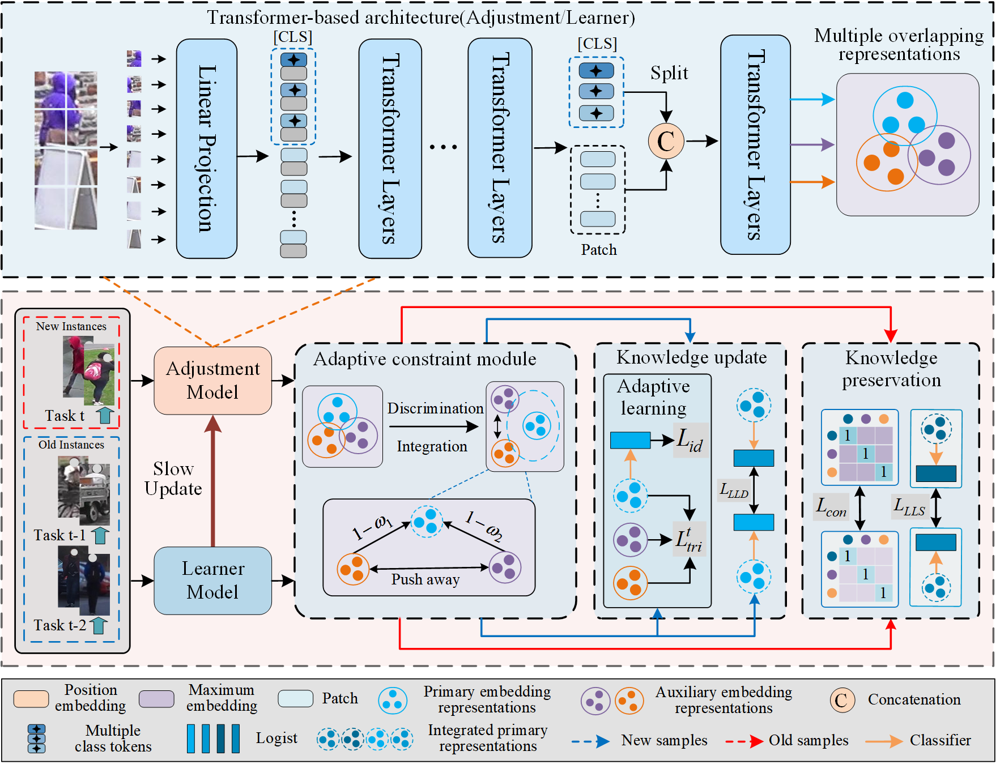

## Diverse Representations Embedding for Lifelong Person Re-Identification (DRE)

<div align="center"> 

📺Our paper has been accepted by [IEEE Transactions on Neural Networks and Learning Systems 2025](https://ieeexplore.ieee.org/document/11045423)  
</div>

# Introduction
```
Our work proposes an “Diverse Representations Embedding for Lifelong Person Re-Identification” (DRE). The proposed DRE adaptively learns diverse representation to achieve a dynamic balance between preserving old knowledge and adapting to new information.
```



## Purpose

```
For the better development of lifelong person re-identification (LReID) under the same protocol, we reorganize seveal LReID code released by authors. These code modifications are as follows:
1) The training protocol follows training order-1 and training order-2 under the seen datasets.
2) Evaluation experiments are conducted on both seen and unseen datasets.
LReID code consist of LifelongReID, PatchKD, PTKP, and KRKC. 
```

## Overview

- Diverse Representations Embedding for Lifelong Person Re-Identification (DRE)

```
The proposed DRE adaptively learns diverse representation to achieve a dynamic balance between preserving old knowledge and adapting to new information.
```

- Lifelong Person Re-Identification via Adaptive Knowledge Accumulation (AKA)

```
AKA constructs learnable knowledge graphs that adaptively accumulate knowledge and preserve topologies.
```

-  Patch-based Knowledge Distillation for Lifelong Person Re-Identification  (PatchKD).

```
PatchKD develops Patch-based Knowledge Distillation and selects adaptive image patches for piloting forget-resistant distillation.
```

-  Lifelong Person Re-identification by Pseudo Task Knowledge Preservation (PTKP).

```
PTKP casts LReID as a source-free domain adaptation problem, where old tasks are treated as a source domain. This way,the feature space for a new task can be mapped to that of an old task for domain consistency learning.
```

-  Lifelong Person Re-Identification via Knowledge Refreshing and Consolidation  (KRKC).

```
 KRKC also improves model performance on both old and new tasks during the lifelong learning process.
```


## Acknowledgement

- Lifelong Person Re-Identification via Adaptive Knowledge Accumulation  [AKA](https://github.com/TPCD/LifelongReID).
-  Patch-based Knowledge Distillation for Lifelong Person Re-Identification  [PatchKD](https://github.com/feifeiobama/PatchKD).
-  Lifelong Person Re-identification by Pseudo Task Knowledge Preservation  [PTKP](https://github.com/g3956/PTKP).
-  Lifelong Person Re-Identification via Knowledge Refreshing and Consolidation  [KRKC](https://github.com/cly234/LReID-KRKC).
